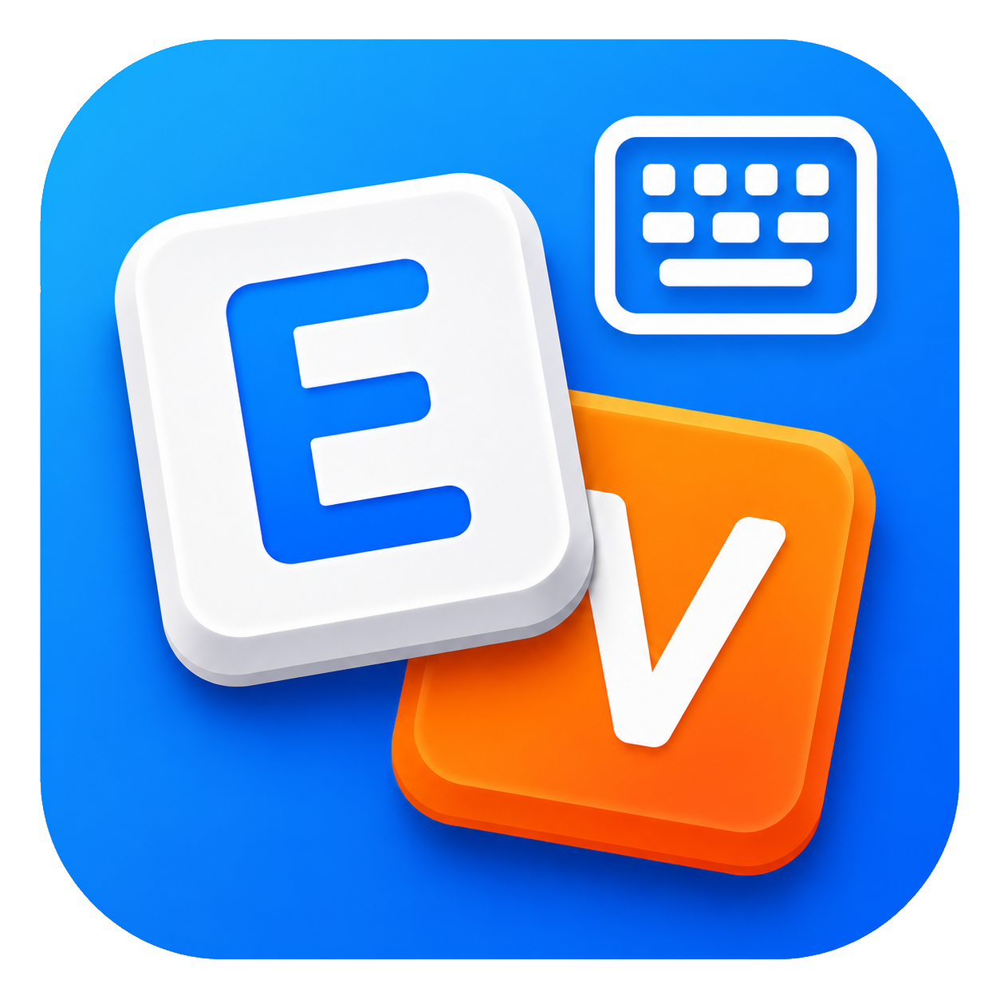

<div align="center">
  

  # VietKi

  **Bộ gõ tiếng Việt nhỏ gọn, đa nền tảng, viết bằng C++17.**

  Telex · VNI · Unicode dựng sẵn · Windows · macOS · Linux/X11

  [](LICENSE)
  
  

  [Tính năng](#-tính-năng) · [Cài đặt](#-cài-đặt--biên-dịch) · [Kiến trúc](#-kiến-trúc) · [Ủng hộ](#-ủng-hộ) · [Ghi nhận](#-ghi-nhận)
</div>

---

VietKi là một bộ gõ tiếng Việt cá nhân sử dụng mô hình **keyboard hook + key
injection**. Một engine C++ dùng chung xử lý tiếng Việt, còn mỗi hệ điều hành có
một lớp tích hợp mỏng riêng.

> [!IMPORTANT]
> Dự án đang trong giai đoạn phát triển. Windows là nền tảng chính; macOS và
> Linux/X11 có shell riêng nhưng có thể còn khác biệt về trải nghiệm.

## ✨ Tính năng

- Gõ tiếng Việt bằng **Telex** và **VNI**.
- Xuất **Unicode dựng sẵn (NFC)**.
- Đặt dấu kiểu mới hoặc kiểu cũ.
- Kiểm tra cấu trúc âm tiết và tự khôi phục từ không hợp lệ.
- Bật/tắt nhanh bằng `Ctrl+Shift` mặc định; hotkey có thể tùy chỉnh.
- Cho phép loại trừ app, đảo tạm V-/V+ cho app hiện tại và tự khôi phục khi
  rời app nếu bật tùy chọn.
- Cửa sổ cài đặt trên Windows với các nhóm Cơ bản, Phím tắt, Hệ thống và Chơi
  game.
- Chế độ Game: danh sách game riêng, hai kiểu dùng là đảo V-/V+ cho game hiện
  tại hoặc bật phiên gõ tiếng Việt tạm thời bằng phím trigger; có overlay và
  tùy chọn dán Unicode cho game khó nhận ký tự.
- Tùy chọn sửa lỗi dấu trong app có autocomplete bằng cách thay thế vùng chọn.
- Khởi động cùng hệ thống; trên Windows có thêm tùy chọn chạy elevated khi đăng
  nhập để gõ được trong cửa sổ admin.
- Chạy portable, không cần installer.
- Không ghi log, lưu trữ hay gửi nội dung phím gõ đi đâu. Bộ đệm của âm tiết
  hiện tại chỉ tồn tại trong RAM và được xóa khi kết thúc từ.

## 📦 Cài đặt & biên dịch

Yêu cầu chung:

- CMake 3.20 trở lên.
- Trình biên dịch hỗ trợ C++17.

### Windows

Yêu cầu Visual Studio 2022 Build Tools với MSVC và Windows SDK. Chạy trong
**Developer PowerShell** hoặc **Developer Command Prompt for VS 2022**:

```powershell
.\build-windows.ps1
```

File chạy được tạo tại `build/Release/VietKi.exe`.

Bạn cũng có thể dùng `build-windows.cmd` trong Developer Command Prompt, hoặc
`sh build-windows.sh` từ Git Bash có sẵn môi trường MSVC.

VietKi lưu cấu hình trong `config.ini` cạnh `VietKi.exe`. Lần chạy thủ công sẽ
mở cửa sổ cài đặt; lần chạy cùng Windows dùng tham số `--autostart` và nằm yên
trong tray. Nếu cần gõ vào app đang chạy quyền admin, hãy chọn **Chạy với quyền
Admin** hoặc bật autostart elevated trong cài đặt.

### macOS

Yêu cầu Xcode Command Line Tools và CMake. Cách nhanh nhất:

```sh
./build-mac.sh
open build-mac/VietKi.app
```

Hoặc build thủ công:

```sh
cmake -B build-mac -S . -DVIETKI_MACOS=ON
cmake --build build-mac
codesign --force --deep --sign - build-mac/VietKi.app
```

Sau khi chạy lần đầu, hãy cấp quyền **Accessibility** và **Input Monitoring**
cho VietKi trong *System Settings → Privacy & Security*.

Để đóng gói thành file `.dmg` cho việc chia sẻ:

```sh
./build-mac-dmg.sh
```

File tạo ra tại `build-mac/VietKi-<version>.dmg`.

Icon `.icns` đã được commit tại `assets/VietKi.icns`. Chỉ cần tạo lại iconset
khi thay nguồn ảnh trong `assets/`.

### Ubuntu / Linux X11

Script sau sẽ cài các gói phát triển cần thiết bằng `apt` rồi biên dịch VietKi:

```sh
sh build-ubuntu.sh
./build-linux/VietKi
```

Ngoài binary `build-linux/VietKi`, script còn tạo gói Debian tại
`build-linux/vietki_<version>_<arch>.deb`:

```sh
sudo apt install ./build-linux/vietki_<version>_<arch>.deb
```

Linux hiện sử dụng XRecord và XTest, vì vậy hỗ trợ Xorg và các ứng dụng X11 qua
XWayland. Ứng dụng Wayland native chưa được hỗ trợ. Cấu hình Linux nằm tại
`~/.config/vietki/config.ini` và danh sách app dùng `WM_CLASS` thay vì tên file
`.exe`.

### Chạy unit test

```sh
cmake -B build -S .
cmake --build build --target vietki_tests
ctest --test-dir build --output-on-failure
```

## 🧩 Kiến trúc

```text
core/       Engine C++17 độc lập hệ điều hành
windows/    Win32 low-level hook, SendInput/clipboard injection, tray, settings
macos/      CGEventTap, CGEvent/clipboard injection và status bar
linux/      XRecord, XTest, GTK, AppIndicator và XDG autostart
tests/      Unit test cho engine và state machine Gaming Mode
assets/     Icon và tài nguyên giao diện
docs/       Đặc tả kỹ thuật và ghi chú triển khai
```

Engine giữ các phím thô của âm tiết hiện tại, dựng lại toàn bộ kết quả sau mỗi
phím rồi tính phần khác biệt cần xóa và chèn. Cách làm này giúp vị trí dấu không
phụ thuộc vào thời điểm người dùng gõ phím dấu.

Các shell hệ điều hành chỉ làm phần tích hợp: bắt phím, xác định app đang focus,
áp dụng danh sách loại trừ/game, rồi thực thi kết quả engine bằng injection phù
hợp với nền tảng. Cấu hình được lưu cục bộ và có thể chỉnh tay.

Tài liệu kỹ thuật chi tiết nằm tại [docs/README.md](docs/README.md) và
[docs/IMPLEMENTATION_GUIDE.md](docs/IMPLEMENTATION_GUIDE.md).

## ☕ Ủng hộ

VietKi miễn phí và mã nguồn mở. Nếu dự án giúp bạn gõ tiếng Việt vui vẻ hơn, bạn
có thể [mời tác giả một ly cà phê](https://github.com/sponsors/linhnh285) để
tiếp thêm nhiên liệu cho những buổi săn bug dấu má :D. Hoặc mã QR momo: 


## 🙏 Ghi nhận

VietKi có tham khảo các ý tưởng, hành vi bộ gõ và kinh nghiệm triển khai từ:

- [UniKey](https://www.unikey.org/) của Phạm Kim Long — đặc biệt là cách tiếp
  cận kiểm tra âm tiết tiếng Việt mà không cần từ điển từ.
- [OpenKey](https://github.com/tuyenvm/OpenKey) của Mai Vũ Tuyên — đặc biệt là
  mô hình sửa chuỗi bằng Backspace/key injection và các tùy chọn trải nghiệm.

UniKey và OpenKey là các dự án độc lập, được phân phối theo giấy phép riêng của
chúng. Việc nhắc đến hai dự án nhằm ghi nhận nguồn tham khảo, không ngụ ý các
tác giả đó bảo trợ hoặc chứng nhận VietKi.

Unit test sử dụng single-header
[doctest](https://github.com/doctest/doctest), được phân phối theo MIT License.
Chi tiết xem tại [THIRD_PARTY_NOTICES.md](THIRD_PARTY_NOTICES.md).

## 📄 Giấy phép

Mã nguồn VietKi được phát hành theo
[GNU General Public License v3.0](LICENSE). Bạn được tự do sử dụng, nghiên cứu,
chỉnh sửa và phân phối lại; các phiên bản phân phối lại hoặc phát triển từ VietKi
cũng phải giữ mã nguồn mở theo GPL-3.0.

Copyright © 2026 LinhNH.
